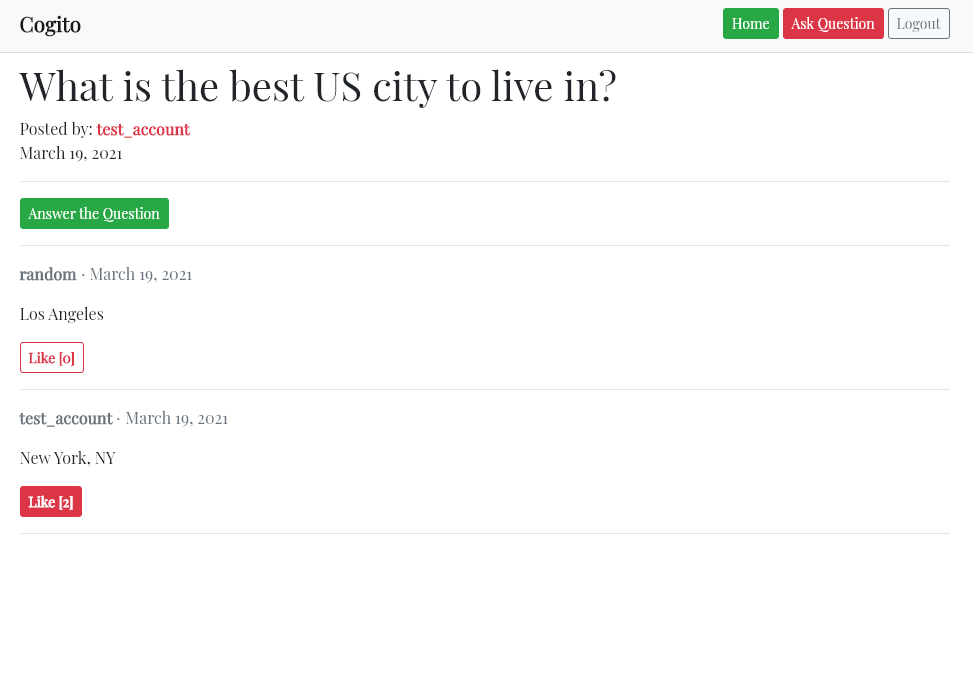

## Cogito

## Link to Deployed Site
https://russellbot.pythonanywhere.com/

## Description
******************
This is a single page application similar to Quora.com where users may post questions, answer questions, and upvote answers. The front end was built using Vue.js framework and the backend was built with Django REST framework.

User authentication was established with Django so users create an account and remain logged in. Users have full CRUD functionality for questions and answers that they have created.  Users may like and unlike answers posted by other members of the site. 

## Installation
*********
To contribute to this work simply fork and clone the repository, navigate to the frontend folder, and then run npm install. The backend may be run by navigating to the cogito folder and running python manage.py runserver.

## Sample
******

